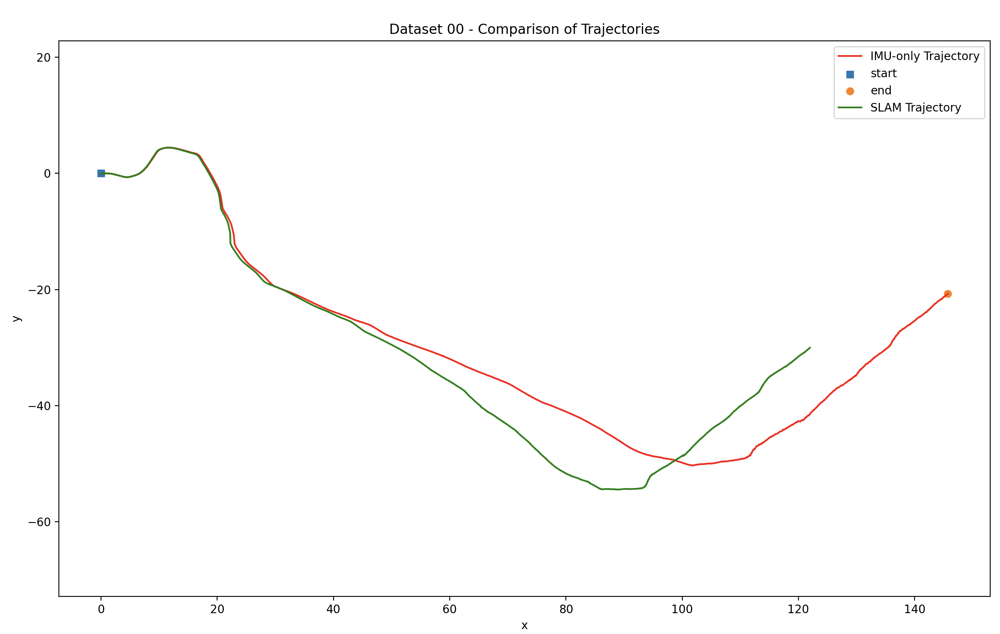
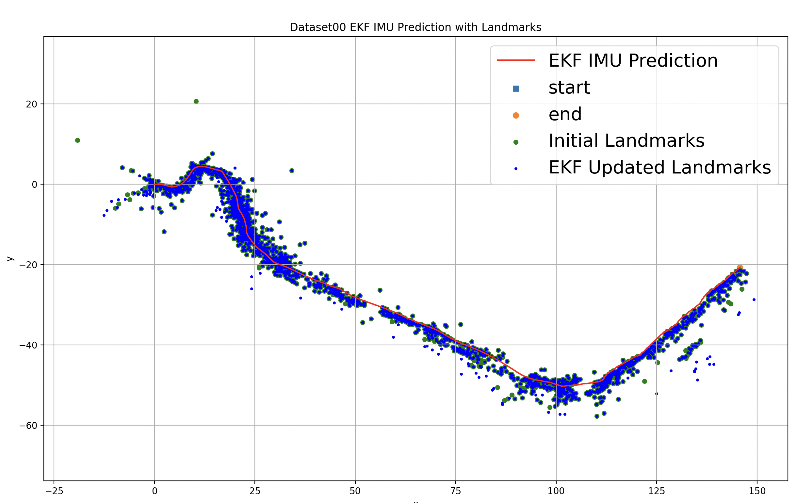
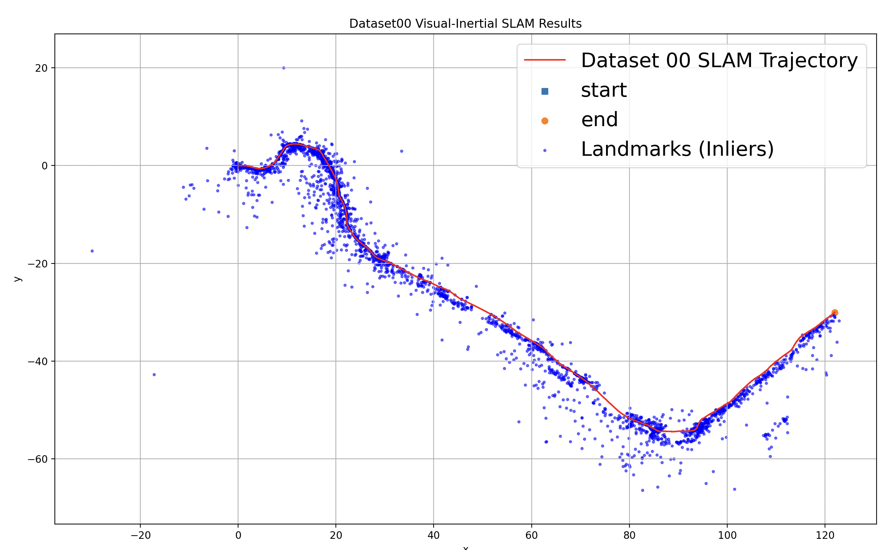

# Visual-Inertial SLAM with EKF

This project implements a **visual-inertial simultaneous localization and mapping (SLAM)** system using an **Extended Kalman Filter (EKF)**. The system fuses measurements from an **inertial measurement unit (IMU)** and a **stereo camera** to estimate both:

* The robot’s 6-DOF pose (position + orientation)
* The 3D positions of static landmarks in the environment

The goal is to achieve accurate localization and mapping even in GPS-denied environments.

---
# IMU vs SLAM Trajectories


# EKF IMU Prediction with Landmarks


# Final Visual-Inertial SLAM Results


## Project Structure

```
├── main.py                  # Main script to run Visual-Inertial SLAM
├── part_1.py                # EKF prediction using IMU data only
├── part_3.py                # Landmark mapping via EKF update (given IMU trajectory)
├── part4.py                 # Full Visual-Inertial SLAM (IMU prediction + landmark update)
├── initialize_loc.py        # Helper for initializing landmark positions
├── pr3_utils.py             # Utility functions (SE3 operations, Jacobians, camera projection, etc.)
```

---

## How to Run

1. **Dependencies:**

   * Python >= 3.8
   * Numpy
   * Scipy
   * OpenCV (cv2)
   * Matplotlib

   Install via:

   ```bash
   pip install numpy scipy opencv-python matplotlib
   ```

2. **Running the code:**

   ### (1) IMU-only EKF prediction

   ```bash
   python part_1.py
   ```

   ### (2) Landmark Mapping (given IMU trajectory)

   ```bash
   python part_3.py
   ```

   ### (3) Full Visual-Inertial SLAM

   ```bash
   python part4.py
   ```

   ### (4) Main wrapper (optional)

   ```bash
   python main.py
   ```

---

## Dataset

The project uses **Clearpath Jackal robot** datasets from **MIT campus**:

* IMU measurements (linear velocity, angular velocity)
* Stereo camera images and visual feature measurements
* Calibration files (intrinsics/extrinsics)

Datasets were provided as part of the **ECE276A: Sensing & Estimation in Robotics** course.

---

## Technical Approach

* **EKF Prediction:**

  * Propagates robot pose using IMU measurements under SE(3) kinematics
* **Landmark Triangulation:**

  * Initialize new landmarks from stereo correspondences

* **EKF Update:**

  * Correct robot pose and landmark estimates with stereo camera measurements
  * Performs Jacobian calculations w\.r.t. state and measurements
  * Handles outlier rejection (invalid landmarks, large reprojection error)
* **State Vector:**

  * Combines robot pose and all 3D landmark positions
  * Maintains full covariance matrix (pose-landmark correlations)

---
